# Hey.D — Serverless Backend

> Production backend for an AI-powered 3D avatar companion app  
> Built at [NationA](https://www.linkedin.com/company/nationa) · Apr 2024 – Jun 2025  
> 🏆 CES Innovation Award Winner (2024 & 2025)  

---

## 🧩 What is Hey.D?
Hey.D is a real-time AI companion app where users chat with 
animated 3D avatars powered by live AI. Available on iOS & Android 
across Korea and the US.

---

## 🏗️ Architecture Overview



The backend is fully serverless on AWS, structured around 
three independent Lambda tracks:

**Main request path**  
`API Gateway` → `Authorizer Lambda` → `idolmaster-api Lambda` 
→ `Service Layer` → Data stores

**Async / background processing**  
`Service Layer` → `Background Lambda` → `S3` + `FCM Push`

**Purchase verification**  
`Client` → `purchase-api Lambda` → `GP / Apple / PortOne` 
→ internal invoke → `idolmaster-api Lambda`

**Monitoring & alerts**  
`CloudWatch Logs` → `error-alarm Lambda` → `Slack Webhook`

---

## ⚙️ Tech Stack

| Layer | Technology |
|---|---|
| Runtime | Python 3.x |
| API | AWS API Gateway (REST + WebSocket) |
| Auth | Authorizer Lambda + AWS Cognito + IAM |
| Core API | idolmaster-api Lambda |
| Database | MariaDB + AWS DynamoDB |
| Storage | AWS S3 |
| Push | Firebase FCM |
| External | Avaturn / Firebase / Gemini APIs |
| Purchase | Google Play / Apple / PortOne |
| CI/CD | GitHub Actions (multi-region: Seoul + US) |
| Monitoring | AWS CloudWatch + Slack Webhook |

---

## 🔑 Key Design Decisions

**Authorizer Lambda as a separate gate**  
All authenticated requests pass through a dedicated 
`idolmaster-authorizer` Lambda before reaching the API — 
keeping auth logic cleanly separated from business logic.

**idolmaster-api routes (REST + WebSocket)**  
A single Lambda handles both REST (`route`, `route_v2`, 
`route_public`) and WebSocket routes, with internal routing 
to the service layer.

**purchase-api as an isolated Lambda**  
Payment verification runs as a completely separate Lambda, 
calling GP / Apple / PortOne externally and internally 
invoking the main API Lambda on success — no coupling to 
the main request path.

**Background Lambda for async tasks**  
Heavy or delayed work (push notifications, storage writes) 
is offloaded to a background Lambda via async invoke — 
keeping the main request path fast.

**Error alarm pipeline**  
CloudWatch log errors trigger a dedicated `error-alarm` Lambda 
that posts structured alerts to Slack via webhook — giving 
real-time visibility into production issues.

---

## 📈 Impact

- Reduced infrastructure costs by **60%** vs traditional server setup
- Cut deployment time by **50%** through GitHub Actions CI/CD
- Platform reached production scale with real users across iOS & Android
- Zero server management — fully scales with traffic automatically

---

## 🔧 Environment Variables

```env
AWS_REGION=
DYNAMODB_TABLE=
S3_BUCKET=
COGNITO_USER_POOL_ID=
MARIADB_HOST=
SLACK_WEBHOOK_URL=
FCM_SERVER_KEY=
```

---

## 📂 Project Structure

```
heyd-backend/
├── idolmaster-api/                  # Main API Lambda
│   ├── lambda_function.py           # Lambda entrypoint
│   ├── routing_api.py               # Request routing dispatcher
│   ├── const.py                     # Constants
│   ├── route/                       # REST API v1 handlers
│   │   ├── avatar.py
│   │   ├── character.py
│   │   ├── chat.py
│   │   ├── groupchat.py
│   │   ├── mission.py
│   │   ├── product.py
│   │   ├── render.py
│   │   ├── user.py
│   │   └── websocket.py             # WebSocket route handler
│   ├── route_v2/                    # REST API v2 handlers
│   │   ├── avatars.py
│   │   ├── avaturn.py
│   │   ├── characters.py
│   │   ├── chatrooms.py
│   │   └── ...
│   ├── route_public/                # Public endpoints (no auth required)
│   │   ├── contents.py
│   │   ├── products.py
│   │   └── ...
│   ├── service/                     # Business logic layer
│   │   ├── avatar.py
│   │   ├── chat.py
│   │   ├── chatroom.py
│   │   ├── character.py
│   │   └── ...
│   ├── thirdparty/                  # External service clients
│   │   ├── mariadb.py
│   │   ├── dynamodb.py
│   │   ├── s3.py
│   │   ├── cognito.py
│   │   ├── firebase_admin.py
│   │   ├── llm_api.py
│   │   ├── use_gemini.py
│   │   ├── avaturn.py
│   │   └── secretmanager.py
│   ├── lib/                         # Shared utilities
│   │   ├── decorator.py
│   │   ├── exception.py
│   │   ├── moderation.py            # Content moderation logic
│   │   ├── crypto.py
│   │   └── ...
│   └── ban_word/                    # Content filtering dictionaries
│       ├── profanity.txt
│       ├── racist.txt
│       ├── sexual.txt
│       └── ...
│
├── idolmaster-authorizer/           # Dedicated auth Lambda (API Gateway Authorizer)
│   ├── lambda_function.py
│   ├── const.py
│   └── mariadb.py
│
├── idolmaster-background/           # Async background processing Lambda
│   ├── lambda_function.py
│   ├── route/
│   │   └── avatars.py
│   ├── service/
│   │   ├── avatar.py
│   │   └── notification.py          # FCM push notification sender
│   ├── thirdparty/
│   │   ├── avaturn.py
│   │   ├── firebase_admin.py
│   │   └── s3.py
│   └── lib/
│
├── idolmaster-error-alarm/          # Error alerting Lambda
│   ├── lambda_function.py
│   ├── ETL.py                       # Log parsing and transformation
│   ├── webhook.py                   # Slack webhook sender
│   └── time_module.py
│
└── purchase-api/                    # Isolated payment verification Lambda
    ├── lambda_function.py
    ├── route/
    │   ├── inapp.py                 # In-app purchases (Google Play / Apple)
    │   └── pg.py                    # PG payments (PortOne)
    ├── service/
    │   ├── inapp.py
    │   └── pg.py
    └── lib/
        ├── invoke.py                # Internal invoke to idolmaster-api
        ├── webhook.py
        └── ...
```
